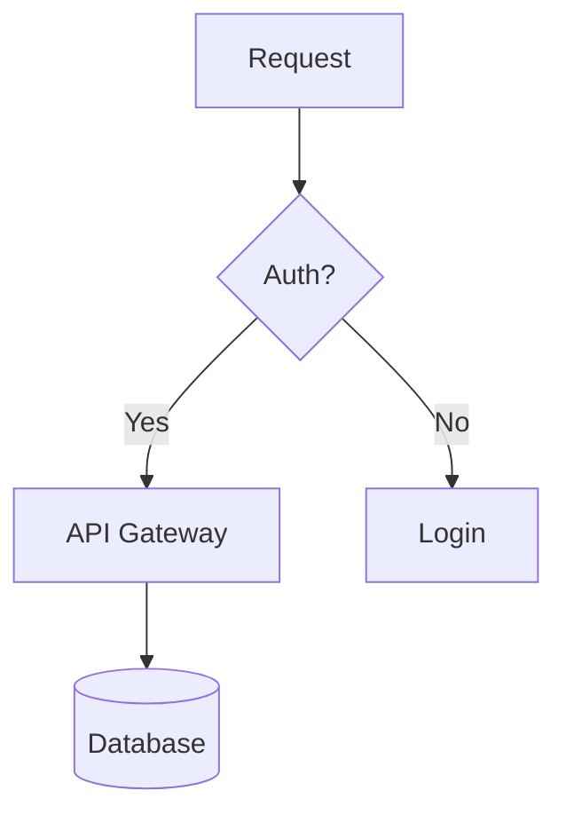
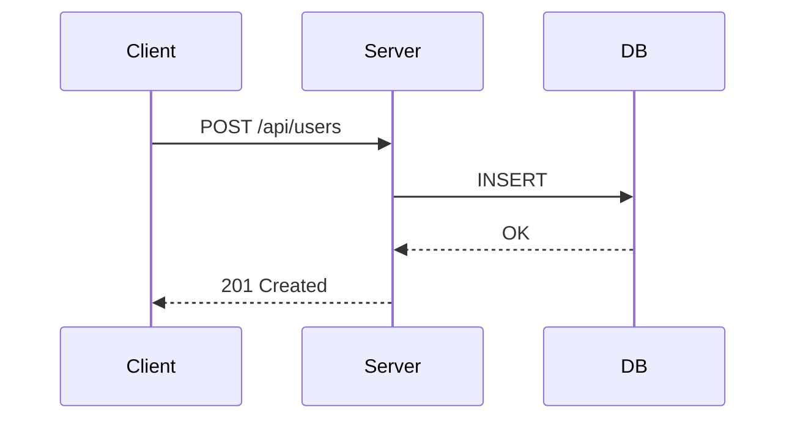

# Markdown Authoring Reference

Reference for markdown documents covering core syntax, GFM extensions, README patterns, technical docs, MDX, and linting. See `references/markdown-guide.md` for a syntax cheat sheet and `references/tech-writing-guide.md` for documentation structure.

## 1. Core Syntax

### Headings

```markdown
# H1 - Document Title (one per file)
## H2 - Major Section
### H3 - Subsection
#### H4 - Detail Level
```

Use ATX style (`#`), not Setext. Space after `#`. Never skip levels. One H1 per file.

### Emphasis and Inline

```markdown
*italic*    **bold**    ***bold italic***    ~~strikethrough~~
`inline code`    <kbd>Ctrl+C</kbd>    <sup>super</sup>    <sub>sub</sub>
```

Prefer `*` over `_` -- underscores in `some_variable_name` cause issues in some parsers.

### Links and Images

```markdown
[Text](https://example.com)                    # inline link
[With title](https://example.com "Hover")      # titled link
[Relative](./docs/setup.md)                    # relative path
[Anchor](#section-name)                        # heading link
           # image

<!-- Reference-style (cleaner in long docs) -->
See the [guide][contrib] and [CoC][coc].
[contrib]: ./CONTRIBUTING.md
[coc]: ./CODE_OF_CONDUCT.md
```

### Lists

```markdown
- Item one                    # unordered (use - consistently)
  - Nested (2-space indent)
1. First step                 # ordered
2. Second step
- [x] Done                   # task list (GFM)
- [ ] Pending
```

### Code Blocks

````markdown
Inline: `npm install`

```javascript
function greet(name) {
  return `Hello, ${name}!`;
}
```

```diff
- const port = 3000;
+ const port = process.env.PORT || 3000;
```
````

Always specify the language: `javascript`, `typescript`, `python`, `bash`, `json`, `yaml`, `sql`, `html`, `css`, `diff`.

### Blockquotes and Rules

```markdown
> Blockquote text.
> > Nested quote.

---                           # horizontal rule (blank lines above/below)
```

## 2. GitHub Flavored Markdown (GFM)

### Tables

```markdown
| Feature | Free | Pro    | Enterprise |
|---------|------|--------|------------|
| Users   | 5    | 50     | Unlimited  |
| Storage | 1 GB | 10 GB  | 100 GB     |

| Left       | Center     | Right      |
|:-----------|:----------:|------------|
| aligned    | centered   | right      |
```

### Alerts (GitHub)

```markdown
> [!NOTE]          > [!TIP]           > [!IMPORTANT]
> Info text.       > Advice text.     > Key info.

> [!WARNING]       > [!CAUTION]
> Urgent info.     > Negative consequences.
```

### Footnotes

```markdown
This needs a source[^1].
[^1]: Source: https://example.com/study
```

### Autolinks and Mentions

```markdown
https://example.com      <!-- auto-linked -->
@username                <!-- user mention -->
#123                     <!-- issue reference -->
org/repo#456             <!-- cross-repo reference -->
```

## 3. Advanced Patterns

### Collapsible Sections

```markdown
<details>
<summary>Click to expand</summary>

Content here (blank line required after summary tag).

</details>
```

### Math / LaTeX

```markdown
Inline: $E = mc^2$

$$
\frac{n!}{k!(n-k)!} = \binom{n}{k}
$$
```

### Mermaid Diagrams

````markdown



````

### Table of Contents

```markdown
## Table of Contents
- [Installation](#installation)
- [Usage](#usage)
  - [CLI](#cli)
  - [API](#api)
```

Anchor rules: lowercase, spaces become `-`, strip punctuation. Auto-generate with `scripts/markdown-linter.sh` (`generate_toc` function), VS Code "Markdown All in One", or `markdown-toc` npm package.

## 4. README Authoring

### Badges (shields.io)

```markdown


```

Parameters: `?style=flat-square`, `?logo=typescript`, `?label=custom`, `?color=ff6600`.

### README Template

See `examples/markdown-structure.json` for a structured template and `references/tech-writing-guide.md` for guidance. Standard sections in order:

1. **Project Name + badges** -- one-liner description with build/license/version badges
2. **Features** -- bullet list of key capabilities
3. **Quick Start** -- minimal install + usage code block
4. **Installation** -- detailed prerequisites and setup
5. **Usage** -- code examples, basic and advanced
6. **Configuration** -- table of options with types and defaults
7. **Contributing** -- link to CONTRIBUTING.md
8. **License** -- license type and link

### Project Structure Trees

```
src/
├── index.ts          # Entry point
├── routes/
│   ├── auth.ts       # Auth routes
│   └── users.ts      # User CRUD
└── utils/
    └── logger.ts     # Logging
```

Generate with `tree -I node_modules`, then annotate.

## 5. Technical Documentation

Follow this hierarchy (detailed in `references/tech-writing-guide.md`):

1. **Overview** -- what and why
2. **Prerequisites** -- tools, versions, access
3. **Installation** -- step-by-step
4. **Quick Start** -- minimal working example
5. **Detailed Guide** -- full walkthrough
6. **API Reference** -- every public interface
7. **Troubleshooting** -- common errors and fixes
8. **Changelog** -- version history

### API Endpoint Pattern

```markdown
### Create User
`POST /api/v1/users`

| Field   | Type   | Required | Description       |
|---------|--------|----------|-------------------|
| `name`  | string | Yes      | Full name         |
| `email` | string | Yes      | Email address     |

**Response (201):**
\`\`\`json
{ "id": "usr_abc123", "name": "Alice", "email": "alice@example.com" }
\`\`\`
```

## 6. MDX

MDX combines markdown with JSX for interactive docs (Docusaurus, Nextra, Astro). MDX v2+ uses ESM imports.

```mdx
import { Button } from '@/components/Button';
import { Callout } from '@/components/Callout';

# Button Component

<Callout type="info">Requires a parent `ThemeProvider`.</Callout>

<Button variant="primary">Click me</Button>

| Prop      | Type                        | Default     |
|-----------|-----------------------------|-------------|
| `variant` | `'primary' \| 'secondary'`  | `'primary'` |
| `size`    | `'sm' \| 'md' \| 'lg'`      | `'md'`      |
```

## 7. Markdown Linting

### markdownlint

```bash
npm install -g markdownlint-cli
markdownlint "**/*.md"
markdownlint --fix "**/*.md"
```

Configuration (`.markdownlint.json`):
```json
{
  "MD013": { "line_length": 120 },
  "MD033": false,
  "MD041": true,
  "MD024": { "siblings_only": true }
}
```

Key rules: **MD001** heading increment, **MD009** no trailing spaces, **MD013** line length, **MD024** no duplicate sibling headings, **MD033** no inline HTML (disable for `<details>`/`<kbd>`), **MD041** first line is H1.

### remark-lint

```bash
npm install remark-cli remark-preset-lint-recommended
npx remark --frail docs/
```

### CI Integration

Use `scripts/markdown-linter.sh` for local linting. For CI:

```yaml
- name: Lint Markdown
  uses: DavidAnson/markdownlint-cli2-action@v19
  with:
    globs: '**/*.md'
```

Use `scripts/markdown-stats.py` to estimate reading time and word counts.

## 8. Conversion

```bash
pandoc README.md -o README.html              # basic HTML
pandoc README.md -s --toc -o README.html     # standalone with TOC
pandoc README.md -o README.pdf               # PDF (requires LaTeX)
npx marked -i README.md -o README.html       # GFM-compatible
```

## 9. Common Mistakes

| Mistake | Fix |
|---------|-----|
| No blank line before list | Add blank line above |
| No blank line after heading | Always blank line after |
| Spaces in URL `[text](my url)` | URL-encode: `%20` or use `<url>` |
| Missing language on code fence | Always add: `` ```python `` |
| Mixing `*` and `-` for lists | Pick one, stick to it |
| Wrong nested list indent | 2 spaces for unordered, 4 for ordered |
| `---` without blank line above | Becomes Setext heading -- add blank line |
| Bare URLs | Use `<https://url>` or `[text](url)` |

### Escaping

```markdown
\*literal asterisks\*   \# not a heading   \| not a table pipe
```

Characters needing escape: `\` `` ` `` `*` `_` `{}` `[]` `()` `#` `+` `-` `.` `!` `|`

## 10. Editor Setup

**VS Code:** Markdown All in One (shortcuts, TOC, preview), markdownlint (inline warnings), Markdown Preview Mermaid Support, Paste Image.

**Prettier:** Add `"proseWrap": "always"` and `"printWidth": 80` in an override for `*.md` files.
